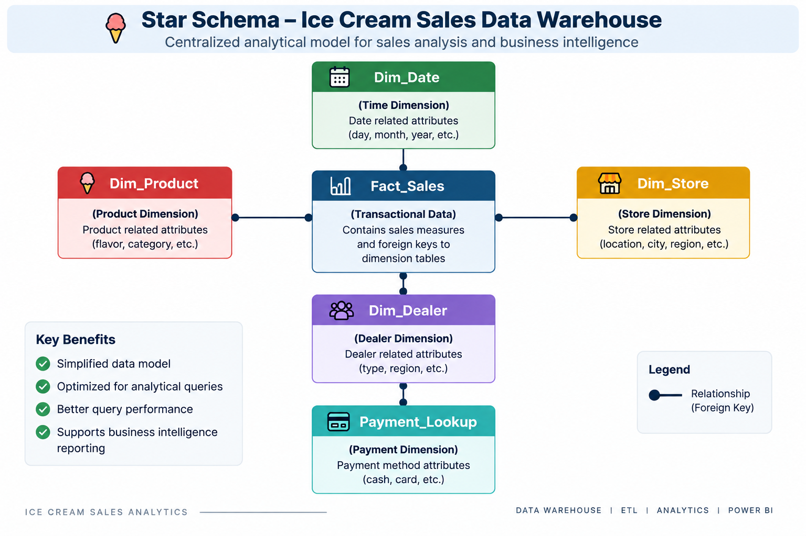

# 🍦 Ice Cream Sales Data Warehouse & Business Intelligence Platform

<p align="center">
  
  
  
  
</p>

## 📌 Project Overview

The **Ice Cream Sales Data Warehouse & Business Intelligence Platform** is an end-to-end analytical solution designed to transform raw operational sales data into a structured, analytics-ready data model for multidimensional business reporting.

Rather than directly connecting a visualization layer to a flat transactional dataset, the project introduces a dedicated **data transformation and dimensional modeling layer** between the source data and the Business Intelligence environment.

The solution combines **PySpark-based ETL processing, dimensional data modeling, fact/dimension decomposition, Star Schema principles, and Microsoft Power BI** to create a structured analytical ecosystem for evaluating sales performance across multiple business dimensions.

The overall analytical workflow follows:

```text
Raw Operational Sales Data
            │
            ▼
      PySpark ETL Layer
            │
            ▼
Data Cleaning & Transformation
            │
            ▼
Dimensional Model Construction
            │
            ▼
 Fact + Dimension Data Layer
            │
            ▼
     Star Schema Model
            │
            ▼
   Power BI Reporting Layer
            │
            ▼
Multidimensional Sales Analytics
            │
            ▼
Business Intelligence & Insights
```

---

## 🚀 Project Highlights

- Developed a **PySpark-based ETL workflow** for transforming raw sales data into analytics-ready structures.
- Decomposed operational data into a centralized **Fact Sales table and supporting analytical dimensions**.
- Applied **dimensional modeling and Star Schema principles** to organize business entities around measurable sales transactions.
- Created dedicated dimensions for **Date, Product, Store, and Dealer analysis**, together with a payment lookup structure.
- Prepared transformed datasets for downstream analytical consumption.
- Built a **Microsoft Power BI reporting layer** over the structured analytical model.
- Enabled multidimensional analysis across products, stores, dealers, payment methods, and time.
- Separated data transformation logic from visualization logic to create a cleaner analytical architecture.

---

## 🎯 Business Problem

Transactional retail datasets are optimized primarily for capturing operational events, but analytical reporting requires a different structure.

A flat sales dataset can make it difficult to consistently analyze questions such as:

- How does sales performance change over time?
- Which products contribute most to business performance?
- Which stores generate stronger sales activity?
- How does dealer performance vary across the business?
- What patterns exist across payment methods?
- How can multiple business dimensions be analyzed from a centralized sales model?

This project addresses these challenges by restructuring operational sales data into a **dimensional analytical model** optimized for Business Intelligence reporting.

---

## 🏗️ Analytical Architecture

The project separates the analytical workflow into multiple logical layers:

### 1. Source Data Layer

Contains the original operational sales dataset used as the input for analytical processing.

### 2. ETL & Transformation Layer

PySpark is used to perform data preparation and transformation operations before analytical modeling.

### 3. Dimensional Data Layer

Transformed data is organized into a central fact structure and supporting business dimensions.

### 4. Business Intelligence Layer

Microsoft Power BI consumes the structured model to produce interactive analytical reports and business insights.

```text
┌──────────────────────────────┐
│   Raw Operational Dataset    │
└──────────────┬───────────────┘
               │
               ▼
┌──────────────────────────────┐
│       PySpark ETL Layer      │
│ Cleaning │ Transformation    │
│ Structuring │ Preparation    │
└──────────────┬───────────────┘
               │
               ▼
┌──────────────────────────────┐
│ Dimensional Analytical Model │
│                              │
│ Fact_Sales                   │
│ Dim_Date                     │
│ Dim_Product                  │
│ Dim_Store                    │
│ Dim_Dealer                   │
│ Payment_Lookup               │
└──────────────┬───────────────┘
               │
               ▼
┌──────────────────────────────┐
│       Power BI Layer         │
│ Modeling │ KPIs │ Reporting  │
└──────────────┬───────────────┘
               │
               ▼
┌──────────────────────────────┐
│ Business Intelligence Output │
└──────────────────────────────┘
```

---

## ⭐ Dimensional Data Model

The analytical layer follows a **Star Schema-oriented architecture**, where sales transactions are represented through a central fact table and analyzed through surrounding business dimensions.

```text
                    Dim_Date
                       │
                       │
                       ▼
Dim_Product ─────► Fact_Sales ◄───── Dim_Store
                       │
                       ▼
                  Dim_Dealer
                       │
                       ▼
                Payment_Lookup
```

> The diagram represents the logical analytical organization of the project. `Payment_Lookup` is retained as a lookup structure to remain consistent with the implemented dataset.

### Star Schema Visualization



The dimensional structure provides a clearer analytical separation between **business measures** and the descriptive attributes used to analyze those measures.

---

## 🧱 Fact Table — `Fact_Sales`

`Fact_Sales` represents the central transactional component of the analytical model.

Its role is to consolidate measurable sales activity while providing the relationships required to analyze those transactions through surrounding dimensions.

Conceptually:

```text
                 Fact_Sales
                     │
        ┌────────────┼────────────┐
        │            │            │
    Measures    Dimension Keys   Sales Events
```

The centralized fact structure enables sales activity to be analyzed consistently across:

- Time
- Products
- Stores
- Dealers
- Payment classifications

This approach reduces the need to repeatedly analyze raw operational records independently for every reporting requirement.

---

## 📚 Dimension & Lookup Layer

### 📅 `Dim_Date`

The Date dimension provides the temporal context required for time-oriented sales analysis.

It supports analytical perspectives such as:

- Date-based reporting
- Monthly analysis
- Period comparisons
- Sales trend evaluation

Separating date information from the transactional layer provides a reusable structure for temporal analysis.

---

### 🍦 `Dim_Product`

The Product dimension represents descriptive product information used to analyze sales performance from a product perspective.

It supports analysis such as:

- Product performance
- Product-level sales contribution
- Product segmentation
- Demand comparison

This allows descriptive product attributes to remain logically separated from transactional sales measures.

---

### 🏪 `Dim_Store`

The Store dimension provides the analytical context required for evaluating sales activity across retail locations.

It enables:

- Store-level comparison
- Location-oriented analysis
- Sales contribution analysis
- Performance segmentation

This provides a dedicated analytical entity for evaluating how sales behavior differs across stores.

---

### 🤝 `Dim_Dealer`

The Dealer dimension enables sales transactions to be analyzed from a dealer or sales-channel perspective.

It supports:

- Dealer contribution analysis
- Comparative performance evaluation
- Dealer-level segmentation
- Sales distribution analysis

---

### 💳 `Payment_Lookup`

The payment lookup structure provides standardized payment classifications for transaction analysis.

It enables the reporting layer to evaluate sales activity across different payment methods while maintaining a reusable reference structure for payment categories.

---

## 🔄 PySpark ETL Pipeline

A major component of this project is the use of **PySpark as the data transformation layer**.

Instead of performing all preparation directly inside the visualization environment, transformation logic is handled upstream before the data reaches the reporting layer.

The ETL workflow follows:

```text
Extract
   │
   ▼
Raw Sales Dataset
   │
   ▼
Transform
   │
   ├── Data Preparation
   ├── Data Cleaning
   ├── Schema Structuring
   ├── Data Type Handling
   ├── Business Entity Separation
   └── Analytical Dataset Preparation
   │
   ▼
Load / Analytical Output
   │
   ├── Fact_Sales
   ├── Dim_Date
   ├── Dim_Product
   ├── Dim_Store
   ├── Dim_Dealer
   └── Payment_Lookup
```

---

## ⚙️ ETL Design Approach

The transformation pipeline is designed around three primary stages.

### Extraction

The source dataset is loaded into the PySpark processing environment for analytical preparation.

### Transformation

Raw records are converted into structured datasets suitable for dimensional analysis.

The transformation stage includes activities such as:

- Data preparation
- Schema organization
- Data type handling
- Business entity separation
- Analytical structuring
- Preparation of fact and dimension datasets

### Analytical Output

The resulting datasets form the structured data layer consumed by the Business Intelligence environment.

This creates a clear separation between:

```text
Operational Data
       ↓
Transformation Logic
       ↓
Analytical Data Model
       ↓
Visualization
```

---

## 🧠 Why Dimensional Modeling?

A major objective of this project was to move beyond analysis of a single flat dataset.

Dimensional modeling provides several analytical advantages:

### Simplified Analytical Relationships

Business entities are separated into dedicated dimensions instead of being repeatedly represented within transactional records.

### Centralized Measures

Sales activity remains centralized inside the fact structure.

### Reusable Dimensions

Product, Store, Dealer, Date, and Payment information can be reused across multiple analytical views.

### Improved BI Organization

The reporting layer receives data in a structure designed specifically for analytical consumption.

### Maintainable Analytical Model

Separating facts from descriptive dimensions makes the model easier to understand, extend, and analyze.

---

## 📊 Power BI Business Intelligence Layer

Microsoft Power BI acts as the visualization and reporting layer of the solution.

The structured analytical datasets are used to create interactive reports capable of evaluating business performance across multiple dimensions.

The reporting layer focuses on several analytical domains.

---

## 📈 Sales Performance Analytics

The solution supports analysis of overall sales activity, including:

- Sales performance monitoring
- Transactional trends
- Quantity analysis
- Business performance comparisons

The objective is to provide a centralized view of operational sales performance.

---

## 🍦 Product Intelligence

Product-oriented analysis enables evaluation of:

- Product performance
- Product contribution
- Demand patterns
- Comparative product behavior

This helps identify stronger and weaker areas of the product portfolio.

---

## 🏪 Store-Level Analytics

Store-oriented reporting provides visibility into:

- Store performance
- Sales distribution
- Location contribution
- Comparative store behavior

This enables business performance to be evaluated beyond aggregate company-wide figures.

---

## 🤝 Dealer Performance Analytics

Dealer-level analysis provides an additional analytical dimension for understanding:

- Dealer contribution
- Sales distribution
- Comparative dealer performance
- Channel-level behavior

---

## 💳 Payment Analysis

Payment classifications provide another perspective for analyzing transactional behavior.

This allows sales activity to be evaluated according to the payment method associated with transactions.

---

## 📅 Time-Based Analysis

The Date dimension enables sales performance to be evaluated across time periods.

This supports:

- Trend analysis
- Period-based reporting
- Temporal comparisons
- Sales behavior evaluation over time

---

## 📷 Dashboard Preview

> Power BI dashboard screenshots are maintained inside the `Screenshots` directory.


---

## 📁 Repository Structure

```text
ice-cream-sales-data-warehouse-analytics/
│
├── Dataset/
│   ├── fact_sales.xlsx
│   ├── dim_date.xlsx
│   ├── dim_product.xlsx
│   ├── dim_store.xlsx
│   ├── dim_dealer.xlsx
│   └── lkp_Payment.xlsx
│
├── PySpark/
│   └── ETL_pipeline.ipynb
│
├── PowerBI/
│   └── IceCream_Sales_Dashboard.pbix
│
├── Screenshots/
│   ├── star_schema.png
│   └── dashboard_overview.png
│
├── .gitignore
│
└── README.md
```

> File names may vary slightly depending on the source dataset and exported analytical files contained in the repository.

---

## 🛠️ Technology Stack

| Layer | Technology / Approach |
|---|---|
| Programming | Python |
| Distributed Data Processing | Apache Spark / PySpark |
| Data Engineering | ETL Transformation Pipeline |
| Analytical Modeling | Dimensional Modeling |
| Schema Design | Star Schema |
| Transactional Layer | Fact Table |
| Descriptive Layer | Dimension & Lookup Tables |
| Business Intelligence | Microsoft Power BI |
| Visualization | Interactive BI Reporting |
| Data Storage | Structured Analytical Files |

---

## 🧩 Technical Concepts Demonstrated

### Data Engineering

- ETL workflow development
- PySpark data processing
- Data transformation
- Analytical dataset preparation
- Schema organization

### Data Warehousing

- Dimensional modeling
- Fact and dimension architecture
- Star Schema design principles
- Separation of measures and descriptive entities
- Analytical data structuring

### Business Intelligence

- Power BI reporting
- Multidimensional analysis
- KPI-oriented reporting
- Interactive visualization
- Business performance analysis

### Analytics Engineering

- Transformation of operational data into analytical structures
- Reusable business dimensions
- Reporting-oriented data modeling
- Separation of transformation and presentation layers

---

## 🔍 Analytical Value

The final architecture enables sales information to be analyzed through several interconnected business perspectives:

```text
                     SALES
                       │
        ┌──────────────┼──────────────┐
        │              │              │
     PRODUCT          STORE          TIME
        │              │              │
        └──────────────┼──────────────┘
                       │
                    DEALER
                       │
                    PAYMENT
```

Rather than treating each analytical requirement independently, the dimensional model provides a centralized structure from which multiple business questions can be explored.

---

## 💡 Key Engineering Takeaways

This project demonstrates the transition from:

```text
Raw Data → Dashboard
```

to a more structured analytical workflow:

```text
Raw Data
   ↓
ETL Processing
   ↓
Data Transformation
   ↓
Dimensional Modeling
   ↓
Analytical Data Layer
   ↓
Business Intelligence
```

The key technical focus is therefore not only dashboard development, but also the **preparation and organization of data before it reaches the visualization layer**.

---

## 🚀 Future Enhancements

The current architecture provides a foundation that could be extended through:

- Incremental data loading strategies
- Automated ETL execution
- Data validation and quality checks
- Pipeline orchestration
- Cloud-based analytical storage
- Data warehouse deployment
- Historical dimension management
- Automated Power BI dataset refresh
- Predictive sales forecasting
- Advanced anomaly and trend detection

These are proposed extensions rather than components of the current implementation.

---

## 👩‍💻 Author

**Muskaan Haleem**

**Data Analyst | Business Intelligence | Data Engineering**

Interested in transforming raw data into structured analytical systems and decision-oriented business intelligence solutions.

---
